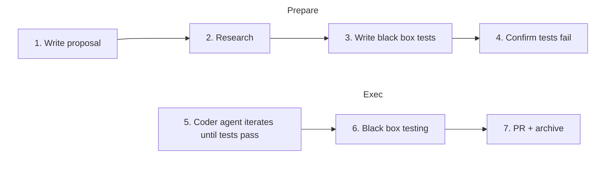

# safe-ai-factory

_Run your AI agent safely in a containerized loop until it writes code that passes your tests._

**Spec-driven AI factory. Use with any agentic CLI. Language-agnostic. Safe by design.**

## The vision

Cursor proved in early 2026 that autonomous AI agents can build an entire browser — but behind closed doors and at massive cost. **safe-ai-factory** is the open source infrastructure to do the same: run AI agents in loops until your specs pass, with full control, auditability, and no vendor lock-in.

**Goal** - Swarm of AI agents that run in parallel. Kubernetes, Docker, or custom.

**Current** - Single containerized AI agent running in loop. Docker-only.

## You write the specs, AI writes the code.

**`safe-ai-factory` implements state-of-the-art (early 2026) architecture for Agentic engineering:**

- Better prompts - Specs enriched with [Shotgun](https://github.com/shotgun-sh/shotgun)
- No reward hacking - AI can't cheat the tests.
- Zero-trust environment with Docker containers.
- Prevents context rot with Ralph Wiggum loop.

**Batteries-included:**

- **21 LLM providers**
- **14 Agentic CLI tools**
- **4 Programming languages**
- **5 Git providers**
- **1 Codebase indexing**

All in a single, safe, spec-driven loop.

Works with the agents you already use - Claude Code, Codex, Aider, OpenHands, Forge, Copilot, and more. No lock-in. One flag: `--agent aider`.

Works with your codebase - Node.js (default), Python, Go, and Rust. Set environment: `--profile python-uv`.

Let your agent create a PR when done - Connect to Github, Gitlab, Gitea, Bitbucket or Azure Repos. Just add: `--push origin --pr`

_Missing an integration? [Write an issue](https://github.com/JuroOravec/safe-ai-factory/issues)_

## Setup

```bash
pnpm install
```

## Usage

```bash
# 0. One-time setup (OpenSpec + Shotgun + codebase index)
saif init

# 1. Scaffold proposal.md and edit it
saif feat new

# 2. Generate specs + generate & validate tests
saif feat design

# 3. Run coding agent in sandbox until tests pass
pnpm agents feat:run
# Prefer Aider?
# pnpm agents feat:run --agent aider

# 5. Mark this change as done and create a PR
pnpm agents feat:finish --push origin --pr
```

## Prerequisites

- Node.js 22+
- Python 3.12+
- Docker
- LLM API key

## Why use `safe-ai-factory`?

This project is for you if you want to use AI agents autonomously,
and you want to avoid these:

- **The AI keeps breaking things I didn't ask it to touch.**
  - Reward hacking - e.g. AI agent rewriting tests to fake a pass.

- **I can't trust AI output without reviewing every line.**
  - You either get bogged down by the huge number of changes, or start blindly approving agent's changes.
  - Spec-driven development

- **Loops get confused after a few iterations.**
  - Each iteration is a blank-slate LLM session. State lives in Git and `progress.md`, not the context window. Works coherently at 50 iterations.

- **Only works for Python/Node?**
  - Graded on exit codes, not language-specific parsers. Any stack that can serve HTTP works.

## Five degrees of security

Autonomous agents looping 50 times on your codebase are dangerous by default.

Five independent boundaries ensure a runaway agent is contained:

1. **Docker isolation - the agent never touches your host:**
   - How: The coder agent runs inside a Docker sandbox.
   - How: Your codebase is copied. Your secrets and `.git` are hidden.
2. **Control network and filesystem access:**
   - How: Every access request is intercepted using [Leash](https://github.com/strongdm/leash).
   - How: Define [Cedar](https://www.cedarpolicy.com/) policies to restrict access.
3. **Memory and process isolation — the coder container is untrusted:**
   - How: We don't run any code in the Agent's container.
   - How: Agent's work is extracted as git diff - plain text file.
   - How: Unsafe changes are stripped from git diff.
4. **Black-box testing:**
   - How: Verification runs in a fresh container. No shared memory, no Docker socket access.
   - How: Tests happen over HTTP requests.
   - Result: Agent can't tamper with the OS.
5. **Fresh container per iteration:**
   - How: Containers are destroyed after every cycle.
   - How: Auxiliary services (database, cache) are destroyed too.
   - The only shared state: `patch.diff` and a `progress.md` written by the orchestrator.

## No reward hacking

When you run agents in a loop, agents will eventually try to cheat to get a green light.

With `safe-ai-factory`, AI agents cannot cheat. No deleting of tests to pass. No hardcoded responses.

Multiple layers prevent the agent from faking a pass.

1. **Separate public and hidden tests:**
   - How: We copy only public tests to Agent's container.
   - How: Results from running the hidden tests are never exposed.
   - Result: Agent never sees hidden tests — cannot hardcode answers.
2. **Tests are protected:**
   - How: [Leash](https://github.com/strongdm/leash) forbids modifying files within the test folders.
   - Result: Agent cannot modify specs or tests, even if it tries.
3. **Black-box over HTTP:**
   - How: Tests runner and agent's code run in two separate containers. No shared memory.
   - Result: Agent cannot mock or patch the test runner.
4. **No git history:**
   - How: We don't copy `.git` to agent's container.
   - Result: Agent cannot read git history to search for answers.
5. **Audit:**
   - How: Leash logs every file and network access.
   - Where: `http://localhost:18080`

## Any language, any agent, any model

`safe-ai-factory` was designed to work with your codebase:

1. **Language-agnostic:**
   - `safe-ai-factory` works with any programming language.
   - Included: NodeJS (default), Python. Go, Rust
   - How: `--profile <id>` or supply custom Docker images and installation scripts to adapt.
   - See [Sandbox profiles →](#sandbox-profiles)
2. **Any agentic CLI:**
   - Included: OpenHands (default), Aider, Claude Code, Forge, GitHub Copilot CLI, Terminus, Codex, Gemini, Qwen, OpenCode, KiloCode, mini-SWE-agent, Deep Agents.
   - How: `--agent <id>` or supply a custom agent script.
   - See [Agents →](docs/agents/README.md)
3. **Any LLM provider:**
   - Included: Anthropic, OpenAI, Google, xAI, Mistral, DeepSeek, Groq, Cohere, Together, Fireworks, DeepInfra, Cerebras, Hugging Face, Moonshot AI, Alibaba, Vertex, Baseten, Perplexity, Vercel, OpenRouter, and Ollama.
   - Set the matching API key (e.g. `ANTHROPIC_API_KEY`, `OPENAI_API_KEY`, `GEMINI_API_KEY`) — the factory picks a default model automatically.
   - Override via `--model anthropic/claude-sonnet-4-6` or target individual agents with `--agent-model coder=openai/o3`.
   - See [LLM configuration →](docs/models.md)
4. **Connect to any repository**
   - Included: Github, Gitlab, Gitea, Bitbucket, and Azure Repos
   - How: `--git-provider <id>`.
   - To connect, pass your API token as env vars (e.g. `GITHUB_TOKEN`, ...)

## The pipeline



Full design: [openspec/specs/software-factory/](openspec/specs/software-factory/).

## Usage in depth

See [docs/usage.md](docs/usage.md) for a step-by-step guide (create feature → define spec → design → generate tests → fail2pass → run agent).

## Source control

Open a PR (or push to remote branch) when tests pass: use `--push origin --pr`.

See [Source control docs](docs/source-control.md) for details. `safe-factory-ai` works with GitHub, GitLab, Bitbucket, Azure Repos, or Gitea.

## Agent CLIs

Use any CLI agent you prefer — we wrap it in our safety loop. See [Agents docs](docs/agents/README.md) for the full list and `--agent <id>` options.

```bash
saif feat run --agent aider
```

## Models

Simply set the API key — the factory auto-detects the provider and picks a sensible default model:

```bash
export ANTHROPIC_API_KEY=sk-ant-...   # → claude-sonnet-4-6
export OPENAI_API_KEY=sk-...          # → gpt-5.4
export OPENROUTER_API_KEY=sk-or-...   # → anthropic/claude-sonnet-4-6 (via OpenRouter)
```

Set a single model for the entire command with `--model`:

```bash
saif feat run --model openai/o3
saif feat run --model openrouter/meta-llama/llama-3.1-405b
```

Target a specific agent while keeping defaults for the rest:

```bash
# Use o3 for the coding agent, leave design agents on their defaults
saif feat run --agent-model coder=openai/o3

# Use a cheap model for PR summaries, strong model for everything else
saif feat run \
  --model anthropic/claude-sonnet-4-6 \
  --agent-model pr-summarizer=openai/gpt-4o-mini
```

Six agents can be targeted individually via `--agent-model <name>=<provider/model>`:
`coder`, `tests-planner`, `tests-catalog`, `tests-writer`, `results-judge`, `pr-summarizer`.

See [Models docs](docs/models.md) for the full reference.

## Sandbox profiles

By default the AI agent is placed inside a container with Node.js + pnpm + Python.

You can pick and switch between language and package manager combinations using **sandbox profiles**.

You don't need to build anything. The factory ships pre-built coder and stage images for Node, Python, Go, and Rust.

Use `--profile` CLI option:

```bash
pnpm agents feat:run --profile python-uv
```

[See all available profiles and step-by-step usage here](./docs/sandbox-profiles.md).

## Test profiles

Tests run in a isolated container that is separated from the sandbox.

You can easily configure in which language + framework to run your tests in with **test profiles**.

Use `--test-profile` CLI option:

```bash
pnpm agents feat:assess --test-profile python-playwright
```

| Profile             | Language + framework          |
| ------------------- | ----------------------------- |
| `node-vitest`       | TypeScript + Vitest (default) |
| `node-playwright`   | TypeScript + Playwright       |
| `python-pytest`     | Python + pytest               |
| `python-playwright` | Python + Playwright           |
| `go-gotest`         | Go + gotest                   |
| `go-playwright`     | Go + Playwright               |
| `rust-rusttest`     | Rust + cargo test             |
| `rust-playwright`   | Rust + Playwright             |

See [docs/test-profiles.md](docs/test-profiles.md) for step-by-step usage.

## Spec designers

By default the factory uses **Shotgun** to turn your feature proposal into a full technical spec before any coding agent runs. Write one paragraph — get back `plan.md`, `specification.md`, `research.md`, and `tasks.md`, all grounded in your existing codebase patterns.

Just like other parts of `safe-ai-factory`, this step is swappable.

Use `--designer` to switch:

```bash
saif feat design
# or explicitly:
saif feat design --designer shotgun
```

| Designer          | Switch with          |
| ----------------- | -------------------- |
| Shotgun (default) | `--designer shotgun` |

[See all available designers and step-by-step usage here](./docs/designers/README.md).

_NOTE: Currently Shotgun is the only supported option. If you want to add your tool, [write an issue](https://github.com/JuroOravec/safe-ai-factory/issues)_

## Codebase indexers

By default the factory uses **Shotgun** to index your codebase before generating specs. The indexer gives the Architect Agent accurate knowledge of your existing patterns — so it writes specs that reference real files and conventions, not guesses.

Use `--indexer` to switch or disable:

```bash
# Index is built automatically during init:
saif init

# Use during spec generation:
saif feat design --indexer shotgun

# Disable:
saif feat design --indexer none
```

| Indexer           | Switch with         |
| ----------------- | ------------------- |
| Shotgun (default) | `--indexer shotgun` |

[See all available indexers and step-by-step usage here](./docs/indexer/README.md).

_NOTE: Currently Shotgun is the only supported option. If you want to add your tool, [write an issue](https://github.com/JuroOravec/safe-ai-factory/issues)_

## Access control with Cedar

By default the factory restricts the agent's filesystem access using a [Cedar](https://www.cedarpolicy.com/) policy enforced by [Leash](https://github.com/strongdm/leash). The agent can read and write anywhere in the workspace — except `openspec/` (reward-hacking prevention) and `.git/` (sandbox-escape prevention).

Override with `--cedar` to supply your own policy:

```bash
pnpm agents feat:run --cedar ./my-policy.cedar
```

[See the full default policy and customization guide here](./docs/cedar-access-control.md).

## Commands

<!-- TODO: COMMANDS IN DEPTH (ALL OPTIONS & WHAT THEY DO - OWN DOC FILE?) -->
<!-- TODO: COMMANDS IN DEPTH (ALL OPTIONS & WHAT THEY DO - OWN DOC FILE?) -->
<!-- TODO: COMMANDS IN DEPTH (ALL OPTIONS & WHAT THEY DO - OWN DOC FILE?) -->

## Reference

- [Usage](./docs/usage.md) - <!-- TODO -->
- [Spec-driven development](./docs/spec-driven-development.md) - <!-- TODO -->
- [Agents](docs/agents/README.md)
- [Sandbox profiles](./docs/sandbox-profiles.md)
- [Test profiles](./docs/test-profiles.md)
- [Spec designers](./docs/designers/README.md)
- [Codebase indexers](./docs/indexer/README.md)
- [Access control with Cedar](./docs/cedar-access-control.md)
- [Commands](docs/commands/README.md) - <!-- TODO -->
- [Environment variable](docs/env-vars.md)
- [Source control integrations](docs/source-control.md)

## Development

See our [Development guide](docs/development.md)

## License

MIT
