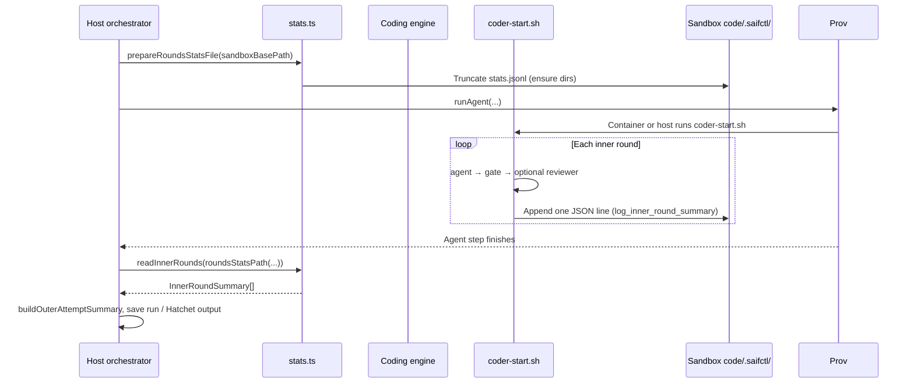

# Inner-round statistics (`stats.jsonl`)

This document describes how the factory records **inner loop** outcomes (agent → gate → optional semantic reviewer) so the **host orchestrator** can attach structured history to each **outer** coding attempt.

For the inner gate loop itself, see [v0/swf-inner-loop.md](./v0/swf-inner-loop.md).

## Why this exists

- **Observability:** Each outer attempt can show how many inner rounds ran, whether the gate or reviewer failed, and a truncated snippet of failure output.
- **Artifacts & workflows:** Parsed rows become `InnerRoundSummary[]`, rolled into `OuterAttemptSummary` for run storage and Hatchet payloads (`src/runs/types.ts`).
- **Stable round indices:** The log file is **truncated at the start of each outer attempt** so `round` in JSON lines always starts from 1 for that attempt.

## End-to-end flow

## On-disk location

| Layer | Path |
| --- | --- |
| Host (orchestrator) | `{sandboxBasePath}/code/.saifctl/stats.jsonl` — see `roundsStatsPath()` in `src/orchestrator/stats.ts` |
| Container | `/workspace/.saifctl/stats.jsonl` (workspace is bind-mounted from `code/`) |

`coder-start.sh` defaults `SAIFCTL_ROUNDS_STATS_PATH` to `$(dirname "$SAIFCTL_TASK_PATH")/stats.jsonl`. The engine sets `SAIFCTL_TASK_PATH` to `{codePath}/.saifctl/task.md`, so the default stats path aligns with the host helper **as long as** `SAIFCTL_ROUNDS_STATS_PATH` is not overridden to something inconsistent.

If you override `SAIFCTL_ROUNDS_STATS_PATH` in `agent-env`, you must keep the file on a path the host still reads (under the mounted workspace) or you will lose stats on the host side.

## JSONL record shape

Each non-empty line is one JSON object. The orchestrator only persists rows with `type === "inner_round"` and a known `phase`.

| Field | Meaning |
| --- | --- |
| `type` | Must be `"inner_round"`. |
| `round` | 1-based index within the current outer attempt. |
| `phase` | `agent_failed` \| `gate_passed` \| `gate_failed` \| `reviewer_passed` \| `reviewer_failed`. |
| `startedAt` / `completedAt` | ISO 8601 timestamps (UTC) for the round. |
| `gateOutput` | JSON string (escaped gate/reviewer output on failure), or JSON `null` when there is no body. Truncated in shell (~2000 bytes before encoding). |

Writer implementation: `log_inner_round_summary` in `src/orchestrator/scripts/coder-start.sh` (JSON string encoding via `json_string_from_file`: `jq`, then `python3`, `node`, `perl`, else empty string).

Reader implementation: `readInnerRounds()` in `src/orchestrator/stats.ts`. Malformed lines, wrong `type`, or invalid `phase` are **skipped** with `consola.warn` so a partial file does not crash the run.

## Host code touchpoints

| Step | Location |
| --- | --- |
| Clear log before agent | `prepareRoundsStatsFile` — `src/orchestrator/loop.ts`, `src/orchestrator/phases/run-agent-phase.ts` |
| Read after agent | `readInnerRounds(roundsStatsPath(sandboxBasePath))` — `src/orchestrator/loop.ts`, `src/hatchet/workflows/feat-run.workflow.ts` |
| Outer-attempt rollup | `buildOuterAttemptSummary` — `src/orchestrator/stats.ts` |

## Related types

- `InnerRoundSummary`, `OuterAttemptSummary`, `InnerRoundPhase`, `OuterAttemptPhase` — `src/runs/types.ts`
