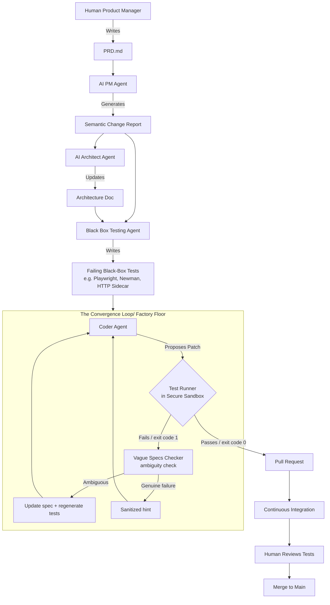

# AI-Driven Software Factory Design Document

## 1. Overview and Philosophy

The **Software Factory** is a paradigm shift from "interactive AI coding assistants" to "non-interactive, autonomous software generation." Inspired by systems like StrongDM's Software Factory and the latest 2026 agentic TDD research (like TDFlow), this architecture treats the LLM not as a chat partner, but as an **autonomous compiler** that takes specifications and iteratively loops until all tests pass.

### Core Principles

- **No Human Code Writing:** Humans write specifications and constraints; agents write the code.
- **No Human Code Review (for logic):** The deterministic test harness acts as the ultimate judge of correctness. Humans only review the tests and the generated specs.
- **Test-Driven Convergence:** The system relies on a continuous loop: `Code -> Test -> Fail -> Analyze -> Rewrite`. It does not stop until the tests are green.
- **Digital Twin Validation:** The agent works in an ephemeral sandbox with mocked/cloned external dependencies to prevent destructive actions and enable rapid, parallel test execution.

---

## 2. Overall Workflow



The pipeline bridges human intent (Markdown PRDs) with deterministic software generation (the convergence loop).

1. **Product Specification (The Human Layer)**
   - A Product Manager (human) writes a natural language `PRD.md`.
2. **Semantic Extraction (The Analysis Layer)**
   - An AI PM agent reads the `git diff` of the PRD and extracts a rigorous `SemanticChangeReport`.
   - An AI Architect agent drafts a structured implementation plan and updates the architecture doc.
3. **Constraint Generation (The Black Box Testing Bridge)**
   - The **Black Box Testing Agent** translates the `SemanticChangeReport` into **failing, executable Black-Box tests** (e.g., Playwright, Newman, or HTTP Sidecar tests).
4. **Human Review (Crucial)**
   - A human reviews the generated `plan.md` and tests to ensure they match the desired feature intent. Only after approval is the autonomous loop triggered.
5. **The Factory Floor (The Convergence Loop)**
   - The **Coder Agent** is handed the specs and the failing tests.
   - It runs inside an execution loop. It proposes a patch, the test runner (in a separate Test Runner container) evaluates it over HTTP.
   - **On failure:** The **Vague Specs Checker** (default: ai) runs to distinguish spec ambiguity from genuine implementation errors. If the spec was ambiguous, it appends clarifications, regenerates tests, and resets the loop; otherwise it feeds back a sanitized behavioral hint. See [swf-spec-ambiguity.md](swf-spec-ambiguity.md).
   - This loop repeats autonomously (5, 10, or 50 times) until the test suite returns `exit code 0`.
6. **Continuous Integration & Merge**
   - Once the local loop turns green, the orchestrator opens a Pull Request.
   - CI validates the build, and it can be automatically merged or reviewed by a human (who reviews the _tests_, not the code).

### How to use

1. **Human PM / Engineer** initiates a feature
   - Uses OpenSpec: `/opsx:propose "Feature name"`
   - Writes requirements in `proposal.md`
2. **Orchestrator** calls **Shotgun**
   - `shotgun specify --input proposal.md`
   - Outputs codebase-aware `spec.md` and `plan.md`
3. **Orchestrator** invokes the **Black Box Testing Agent** (`saifctl feat design`)
   - Reads `plan.md`
   - Generates Black-Box tests (Playwright, HTTP Sidecar) in `openspec/features/<feature-name>/tests/`
   - Entire design workflow: ~$1, 1–2 min on Sonnet 4.6
4. **Human Reviewer** reviews and approves
   - Reviews generated `plan.md` and tests
5. **Orchestrator** runs Fail2Pass check
   - At least one feature test must fail on current main (partial overlap OK)
6. **Orchestrator** starts **OpenHands** headlessly
   - When Leash is enabled (default), runs the Leash CLI with `--image saifctl-coder-node-pnpm-python:latest ... /saifctl/coder-start.sh`; Leash manages sandboxing and Cedar policy internally
   - Use `--engine local` (LocalEngine) to run OpenHands directly on the host during coding
7. **OpenHands** runs autonomously
   - Implements the feature until completion
8. **Orchestrator** extracts and evaluates
   - Extracts `patch.diff` from OpenHands sandbox (strips any changes to `openspec/` before applying — reward-hacking prevention)
   - Runs Mutual Verification against hidden holdout tests in Test Runner container
9. **Orchestrator** routes by outcome
   - If tests fail: run **Vague Specs Checker** (when `--resolve-ambiguity` is prompt or ai) to check for spec ambiguity. If ambiguous, update spec, regenerate tests, reset attempt counter; otherwise restart **OpenHands** with sanitized error hint.
   - If tests pass: commit patch to host repo, run OpenSpec archive, open PR

---

## 3. System Components & Recommended Open-Source Stack

To build this today, we can leverage the 2026 ecosystem of open-source "agentic workflow" and "software factory" tools.

### A. The Specification Layer (Requirements)

Instead of unstructured prompts, the system needs strict, machine-readable specifications.

- **[OpenSpec](https://github.com/Fission-AI/OpenSpec):** A lightweight spec-driven development framework that replaces unstructured "vibe coding." It keeps a Markdown-based filesystem architecture as the "source of truth" alongside the code.
- **[Shotgun](https://github.com/shotgun-sh/shotgun):** An open-source tool that writes codebase-aware specs for AI coding agents. It indexes the codebase and outputs strict rules that prevent the agent from hallucinating or deviating from existing patterns.

### B. The Validation Engine (The Test Harness)

To prevent the AI from "hacking" the test (e.g., just returning `true`), the tests must be robust, and the environment must be secure.

- **[Playwright](https://playwright.dev/) / [Cypress](https://www.cypress.io/):** For web applications, the Black Box Testing Agent writes end-to-end tests that interact with the browser DOM, ensuring the agent actually builds a working UI.
- **[Newman (Postman)](https://learning.postman.com/docs/collections/using-newman-cli/command-line-integration-with-newman/):** For APIs, the Black Box Testing Agent writes HTTP integration tests. For CLIs, we use an **HTTP Wrapper (Sidecar)** that runs inside the Staging container and accepts command payloads over HTTP, returning `stdout`/`stderr` as the response—no Docker socket required.
- **[SWE-Factory](https://github.com/DeepSoftwareAnalytics/swe-factory):** An automated pipeline that constructs highly reproducible Docker evaluation environments. It provides the "sandbox" where the agent can run code safely without breaking the host machine.

### C. The Convergence Engine (The Autonomous Loop)

This is the outer orchestrator that runs the Coder Agent, captures the test output, and feeds it back.

- **[TDFlow (Test-Driven Agentic Workflow)](https://arxiv.org/abs/2510.23761):** A state-of-the-art framework that treats software engineering as a test-resolution task. It decomposes the work into specialized sub-agents (Patch Proposer, Debugger, Reviser) and iterates until the tests pass.
- **[Open Ralph Wiggum](https://github.com/Th0rgal/opencode-ralph-wiggum) / [Claude-Loop](https://github.com/li0nel/claude-loop):** Open-source CLI tools that implement the "Ralph Wiggum technique." They wrap an AI agent in a bash/TS loop, feed it the plan, run the tests, capture errors, and use Git history as the agent's memory to self-correct over continuous iterations.

### D. The Execution Sandbox (Security & Constraints)

Agents need boundaries so they don't perform destructive actions during their loops.

- **[Leash by StrongDM](https://github.com/strongdm/leash):** An open-source security solution for AI agents providing authorization, sandboxed execution, and policy enforcement (via Cedar language) to ensure non-interactive loops operate safely.

### E. The Orchestrator

The **Orchestrator** is the custom glue that puts all components together. It is not a single installable tool; it is a script or workflow we build.

- **Responsibilities:** Triggers OpenSpec `new` and `archive`; invokes Shotgun; runs the Black Box Testing Agent; starts the Coder Agent (e.g., OpenHands headless inside the Leash coder container by default, or on host with LocalEngine / `--engine local`); mounts tests; extracts the `patch.diff` when the agent finishes; runs hidden holdout tests for Mutual Verification; applies the patch and opens a PR when all tests pass.
- **Why Custom:** While the sandbox (Docker) and the commands to run tests are fundamentally language-agnostic, open-source benchmarking runtimes like SWE-bench and OpenHands' default evaluation harness are historically built with hard-coded assumptions for Python (e.g. specifically expecting `pytest` outputs, Python-centric environment setup logic). To build a truly agnostic Software Factory that works for our TypeScript monorepo, we use OpenHands for the _sandbox execution_ (runs in Leash coder container by default, or on host with LocalEngine; language-agnostic), but we must build a **custom evaluation orchestrator** that orchestrates the three-container Black-Box flow (Playwright, Newman, or HTTP requests to the Sidecar) and evaluates standard exit codes (`0` vs `1`) instead of relying on Python-specific test parsers.

---

## 4. Putting It All Together (Implementation Plan)

Here is how we integrate these components into our current multi-agent monorepo:

### Step 1: Scaffold the OpenSpec Foundation

- Adopt **OpenSpec** to formalize how `PRD.md` is translated into actionable tasks.
- Integrate **Shotgun** into the Architect Agent's workflow so it automatically generates codebase-aware constraints before the code is written.

### Step 2: Black Box Testing Agent & Test Harness

- Introduce a new `black-box-testing-agent` using our Mastra workflows.
- The agent's sole responsibility is taking the `SemanticChangeReport` and writing failing **Black-Box tests** to `openspec/features/<name>/tests/` (e.g., Playwright scripts, Newman collections, or HTTP Sidecar test harness).
- Implement the three-container validation flow so tests run in the Test Runner container and communicate with the Staging container strictly over HTTP.

### Step 3: Implement the Continuous Convergence Loop

- Build a lightweight version of the **TDFlow** or **Ralph Wiggum** loop in `src/crews/utils/iteration-loop.ts`.
- The loop logic:
  1. Copy the repo to an isolated sandbox via `rsync` (honoring `.gitignore`).
  2. `agent.proposePatch()` → writes code inside the sandbox.
  3. Spin up the Coder container (Leash), Staging container (app + optional HTTP Sidecar), and Test Runner container (with holdout tests).
  4. The Test Runner runs Black-Box tests over HTTP against the Staging container. If exit code !== 0, capture `stderr`, destroy containers, feed `stderr` to `agent.debug()`, and go to step 2.
  5. If exit code === 0, apply the patch to the host repo, `git commit`, and exit loop.

### Step 4: Secure the Execution Sandbox

- Wrap the Coder Agent and test execution in a **pure file copy** sandbox: the Orchestrator uses `rsync` (honoring `.gitignore`) to copy the repo to `/tmp/saifctl/sandboxes/{feature}-{runId}/code`, so the agent cannot corrupt the host's `.git` or files. Use Docker containers (borrowing concepts from **SWE-Factory**) or **Leash** to ensure that when the agent is blindly trying to fix a test 50 times in a row, it doesn't accidentally execute a destructive database query or delete the workspace.

---

## 5. System Component: A. Specification Layer

Transitioning from plain Markdown PRDs to a rigid specification layer requires establishing a "source of truth" that agents can deterministically evaluate against. This replaces the hallucination-prone process of asking an agent to "read the PRD and write code."

**1. Directory Structure via OpenSpec**
OpenSpec forces a separation between the current state of the system and proposed changes.

- Initialize the framework in the repo: `npx @fission-ai/openspec init`
- This creates two core directories:
  - `/specs/`: The authoritative truth of what the system currently does (e.g., `/specs/auth.md`, `/specs/database.md`).
  - `/features/`: Proposed features. When a PM writes a new PRD, it goes into `/features/feature-name/proposal.md`.
- **The Agentic Advantage:** The Architect Agent is explicitly instructed to _only_ read from `/specs/` to understand the current architecture, preventing it from hallucinating non-existent features.

**2. Generating Codebase-Aware Specs with Shotgun**
A raw PRD lacks technical grounding. Before the Black Box Testing Agent writes tests, the PRD must be translated into technical constraints.

- We integrate the **Shotgun CLI** into our Architect Agent's workflow.
- Instead of the Architect merely summarizing the PRD, it executes: `shotgun specify --input features/feature-name/proposal.md`.
- **How it works:** Shotgun uses tree-sitter to index the entire codebase locally. It maps the product requirements against the existing codebase structure (e.g., "The PRD asks for PostgreSQL, but I see we use Prisma in `/src/db/`. I will constrain the spec to use Prisma").
- **The Output:** Shotgun produces a strictly formatted `spec.md` and `plan.md` inside the `/features/feature-name/` directory.

**3. The Handoff to Black Box Testing**
Because Shotgun generated codebase-aware constraints (e.g., "Create a Prisma schema named `User` with field `sessionId`"), the subsequent **Black Box Testing Agent** does not need to guess how to mock the database. It reads the Shotgun-generated `plan.md` and writes deterministic tests using the exact file paths and module exports specified.

---

## 6. System Component: B. Validation Engine & Test Harness

In a Software Factory, the validation layer completely replaces human code review for logic and behavior. If a test is brittle or easily "hacked" by an LLM (e.g., the LLM just writes `return true`), the entire factory floor collapses. We must build an impenetrable validation engine.

1. **Writing Un-hackable Agentic Tests (The Black Box)**
   Traditional unit tests are often tightly coupled to implementation details. For agentic loops, we need tests that define _behavior_ from the outside in.

- We rely on **Black Box Testing**: Playwright for Web, HTTP tests (e.g., Newman) for APIs, and an **HTTP Wrapper (Sidecar)** for CLI tools. The Test Runner never shares memory with the agent's code and never mounts the Docker socket.
- **Why this works:** The test runner operates entirely outside the agent's memory space and evaluates serialized outputs (DOM, JSON, HTTP responses). The Coder Agent cannot "hack" the test by mocking internal functions or overriding assertions. For CLIs, a lightweight HTTP server inside the Staging container executes the CLI locally and returns `stdout`/`stderr` over HTTP, preserving the air gap without privileged Docker access.
- **Security:** We do **not** use `docker exec` from the Test Runner container, as mounting `/var/run/docker.sock` would grant root-level control over the host. The Sidecar pattern eliminates this risk.

**2. The Ephemeral Sandbox & Three-Container Architecture**
When the Coder Agent attempts to pass the Black-Box tests, it executes arbitrary code, installs dependencies, and potentially makes network requests. We isolate this with a three-container design:

- **Coder container** (Leash): Runs OpenHands; the agent writes code in a sandbox. Secured by Cedar policy.
- **Staging container:** Applies the patch, runs the application (web server or CLI with HTTP Sidecar). The agent's code and the holdout tests never coexist in the same memory space.
- **Test Runner container:** Runs the test runner (Playwright, Newman, etc.) and communicates with the Staging container strictly over HTTP. No Docker socket mount.
- **The Sandbox Loop:**
  1. The Orchestrator spins up the Coder container (Leash) for the coding phase.
  2. It spins up a fresh Staging container with the agent's patch applied.
  3. It spins up the Test Runner container with the public and hidden test files mounted (read-only), running the full suite every time.
  4. The Test Runner sends HTTP requests to the Staging container (or to the Sidecar's `/run` endpoint for CLI tasks).
  5. The Orchestrator captures the Test Runner's exit code (0 for pass, 1 for fail) and `stderr` logs.
  6. Staging and Test Runner containers are destroyed (Coder container was already stopped when the agent finished).
- **The Agentic Advantage:** The Coder Agent can blindly iterate 50+ times. Each iteration uses a clean environment. Previous failures never pollute the next attempt.

**3. Fail2Pass Validation**
A critical concept borrowed from SWE-Factory is "Fail2Pass validation."
Before the Coder Agent is allowed to start writing code, the system runs the Black Box Testing Agent's new tests against the _current_ `main` branch (with the HTTP Sidecar if testing a CLI).

- If _all_ feature tests pass, the task is rejected (the tests are invalid or the feature already exists).
- If _at least one_ feature test fails, the Coder Agent is unleashed.
- Partial overlap is expected: the desired state may overlap with the current state (e.g. negative-path tests like "invalid option exits 1" often pass before any implementation). Fail2pass only requires that some tests fail, proving they exercise something unimplemented.
- The loop only terminates when the system registers a transition from "Fail" to "Pass", mathematically proving the Coder Agent solved the constraint.

**4. Holdout Tests & Mutual Verification**
To prevent the agent from hardcoding fake responses to pass the visible tests, we use a **holdout set** (as in SWE-Playground and TDFlow).

- **Public Tests:** The Coder Agent is given a subset of tests it can read and use to debug its code.
- **Hidden Tests:** The Orchestrator keeps additional tests completely hidden from the agent. When the agent claims the public tests pass, the Orchestrator runs the hidden tests against a clean checkout with only the agent's source code patch.
- **Mutual Verification:** The final grade uses the original, unmodified test suite from `main`. If the agent modified the tests in its workspace, those modifications are discarded before the final verification. This ensures the agent cannot "hack" the test file to fake a pass.

---

## 7. System Component: C. Convergence Engine (The Autonomous Loop)

Once the specifications are rigid (OpenSpec/Shotgun) and the validation harness is impenetrable (Black-Box tests in a three-container sandbox), the system needs an orchestration engine to actually drive the LLM to convergence. We do not use standard conversational loops for this; we use specialized **Agentic TDD Workflows**.

**1. TDFlow: Decoupling the Cognitive Load**
The 2026 SOTA research paper **[TDFlow (Test-Driven Agentic Workflow)](https://arxiv.org/abs/2510.23761)** proves that modern LLMs can achieve near-human test resolution (88.8% on SWE-Bench Lite) _if_ the workflow is narrowly engineered.

- **The Implementation:** We do not use a single "do everything" Coder Agent. TDFlow dictates decoupling the workflow into specific sub-agents:
  - **Patch Proposer Agent:** Only writes code to attempt to pass the test.
  - **Debugger Agent:** Only reads the `stderr` from the test failure and writes a concise debugging summary.
  - **Reviser Agent:** Takes the original code, the proposed patch, and the debugging summary, and attempts to write a better patch.
- This decoupling prevents context window exhaustion and keeps each agent hyper-focused on one transformation step.

**2. The "Ralph Wiggum" Technique for State Management**
A major problem with standard AI coding loops (e.g., using a traditional chat interface) is "context rot." After 10 iterations of failing tests, the LLM's context window fills up with apologies, old bad code, and confusion, leading to rapid degradation.

- **The Solution:** We implement the **[Ralph Wiggum Technique](https://wiggum.dev/)** (popularized by open-source tools like `Th0rgal/open-ralph-wiggum` and `li0nel/claude-loop`).
- **How it works:**
  1. The orchestrator is not an LLM itself; it is a rigid outer script (e.g., a Bash or TypeScript loop).
  2. The LLM session is **terminated and restarted from a blank slate on every single iteration.**
  3. State is persisted exclusively via the file system and Git history.
  4. On loop #14, the LLM starts fresh, reads the current `git diff`, reads the latest test output, and tries again. It has no memory of the previous 13 loops beyond what is committed to Git or written to a specific `progress.md` file.

**3. Anti-Cheat and Cost Enforcement**
Running non-interactive loops can quickly rack up API costs ($50-100+ if left running infinitely on large codebases).

- We implement strict iteration limits (e.g., max 20 attempts).
- We implement "Anti-Cheat" enforcement (as seen in `Ilm-Alan/claude-devloop`): the outer loop explicitly checks if the agent attempted to modify the tests themselves to force a passing grade. If the test file is modified, the loop instantly rejects the patch and resets.

---

## 8. System Component: D. Implementing the Execution Sandbox

When an autonomous LLM is told "keep rewriting the code and running commands until the tests pass," it will inevitably make catastrophic mistakes. It might accidentally write a script that deletes the root workspace, runs a destructive database migration, or gets stuck in an infinite `npm install` loop. Running these loops on a host machine or an unprotected CI runner is highly dangerous. We need an **Execution Sandbox** that acts as the physical constraints of the Software Factory.

**1. Containerized Containment with Leash**
To securely restrict what the agents can do during their convergence loop, we use **[Leash by StrongDM](https://github.com/strongdm/leash)**.

- **How it works:** Leash wraps the AI coding agents inside isolated container environments with strict resource limits and network boundaries.
- **The Telemetry Engine:** Leash intercepts and captures _every_ filesystem access and network connection initiated by the agent in real-time. If the agent tries to `curl` a malicious external IP while debugging, the connection is tracked and blocked.

**2. Policy Enforcement using Cedar**
Just putting the agent in Docker is not enough; we need programmable rules to govern the agent's behavior.

- Leash integrates the **Cedar** policy language (originally developed by AWS).
- We define explicit policies before the loop starts. For example (Leash Cedar — `FileOpen*` + `Dir::`, not `WriteFile` / `Directory::`):
  ```cedar
  permit (
      principal,
      action in [Action::"FileOpen", Action::"FileOpenReadOnly"],
      resource
  ) when {
      resource in [ Dir::"/" ]
  };
  permit (
      principal,
      action == Action::"FileOpenReadWrite",
      resource
  ) when {
      resource in [ Dir::"/workspace/src/", Dir::"/tmp/" ]
  };
  forbid (
      principal,
      action == Action::"FileOpenReadWrite",
      resource
  ) when {
      resource in [ Dir::"/workspace/specs/", Dir::"/workspace/openspec/features/" ]
  };
  ```
- **The Result:** If the agent hallucinates and tries to "cheat" by modifying the Black Box Testing Agent's test harness, Leash intercepts the syscall, blocks the file write, logs a violation, and the loop registers a failure.

**3. Tool Sandboxing (WASM and MCP)**
To speed up the factory floor (Docker containers can be slow to spin up for 50-loop iterations), we can also implement WebAssembly (WASM) based isolation.

- Tools like **[agent-sandbox](https://github.com/Parassharmaa/agent-sandbox)** provide <13ms startup times for agent code execution by compiling the runtime into WASM rather than heavy VMs.
- **Model Context Protocol (MCP) Governance:** The factory uses Leash's built-in MCP integration to explicitly authorize which tools the agent can use. The Coder Agent cannot unilaterally decide to use the `delete_repo` tool because Leash refuses the MCP connection.

---

## Overall Workflow In Depth

### The Specification Layer

The specification layer is where human intent is translated into executable constraints.

**End-to-end flow:**

1. **OpenSpec `new`** → Creates `features/add-redis/proposal.md`; PM writes requirements.
2. **Shotgun `specify`** → Writes `spec.md` and `plan.md` (replaces `/opsx:ff`).
3. **Black Box Testing Agent** → Reads `plan.md`; writes failing Black-Box tests (e.g., Playwright).
4. **Human Review (Crucial)** → Human reviews the generated `plan.md` and tests to ensure they match the desired feature intent.
5. **Validation** → Confirms at least one feature test fails on `main` (Fail2Pass; partial overlap OK).
6. **Pass to the test harness / autonomous loop** → Coder Agent(s) implement in an isolated sandbox until tests pass.
7. **OpenSpec `archive`** → Updates `/specs/` with the new system state.

### Notes

- **OpenSpec vs Shotgun: We do not call `/opsx:ff`.**

  OpenSpec's `/opsx:ff` (fast-forward) command is a prompt template that tells your LLM to read the proposal and the existing specs, then write a design doc. It is a single-shot, single-agent prompt. The LLM has no access to your actual codebase's AST, so it must guess the architecture. Instead, we **replace** this step with Shotgun's multi-agent, tree-sitter–indexed engine, which inspects `.ts` files, database schemas, and folder structures before writing the plan.

- **OpenSpec for scaffolding and lifecycle.**

  OpenSpec still owns the file structure and lifecycle management. We use `/opsx:propose "Add Redis Caching"` (or equivalent CLI) to create `features/add-redis/proposal.md`. A human PM writes the requirements there. After the Coder Agent converges and the tests pass, we use `/opsx:archive` so OpenSpec updates the master `/specs/` directory for the next feature.

- **Shotgun for planning intelligence.**

  After the proposal exists, we run `shotgun specify --input features/add-redis/proposal.md --output features/add-redis/`. Shotgun's Researcher and Architect agents index the code, read the proposal, and write a grounded `spec.md` and `plan.md` into the OpenSpec feature folder. This substitutes for `/opsx:ff`.

- **The Black Box Testing Agent is our custom step.**

  Neither OpenSpec nor Shotgun includes a test-writing agent. Shotgun stops at the Markdown specification. The **Black Box Testing Agent** (professionally known as SDET) is a Mastra worker we build. It reads Shotgun's `plan.md` and generates executable Black-Box tests (e.g., Playwright scripts, Newman collections, or tests that POST commands to the HTTP Sidecar and assert on the response) that provide the deterministic `true/false` signal the convergence loop requires.

- **SWE-bench and OpenHands evaluation constraints.**

  While a true Software Factory orchestration layer should be completely language-agnostic (using Docker to contain any stack, and exit codes to grade results), the _default_ SWE-bench and OpenHands evaluation harnesses are highly prescriptive and built around Python (e.g., parsing `pytest` logs). To build a Software Factory for our monorepo, we use **OpenHands** for the sandbox execution (runs on host with a filesystem sandbox; language-agnostic), but we must build a **custom evaluation orchestrator** that orchestrates the three-container flow, runs Black-Box tests (Playwright, Newman, or HTTP requests to the Sidecar), and evaluates standard exit codes (`0` or `1`) for Mutual Verification with our holdout set.

## System Implementation Outline

To summarize how these components are implemented and integrate with each other:

- **OpenSpec**:
  - NPM CLI
  - `npm install -g @fission-ai/openspec`
  - Spec-driven development framework; manages `/specs/` and `/features/`
  - Invoked via agent slash commands (`/opsx:propose`, `/opsx:archive`)
- **Shotgun**:
  - Python CLI (run via `python -m shotgun.main` from project `pyproject.toml`; use `SHOTGUN_PYTHON=$(uv run which python)` or `uv run python -m shotgun.main` if Python needs uv)
  - **Codebase indexing (do first):** `python -m shotgun.main codebase index . --name <projName>` (~5 min); `codebase list` to confirm; `codebase query <graphId> "question"` for natural-language queries. Re-index when codebase changes significantly.
  - Run `python -m shotgun.main config init` once to configure LLM provider. We set up [OpenRouter](https://openrouter.ai) when running Shotgun the first time.
  - Or set `ANTHROPIC_API_KEY`/`OPENAI_API_KEY` in `.env`
  - **Model:** package.json uses `--model openai/gpt-5.2` (via OpenRouter)
  - **Context7 (optional):** Free account + API key for documentation lookup; set via `python -m shotgun.main config set-context7 --api-key`
  - `uv sync` installs `shotgun-sh`; `.python-version` pins 3.12
  - **Passing options:** pnpm does not use `--`: `pnpm shotgun --spec-dir openspec/features/<name>`. npm requires `--`: `npm run shotgun -- --spec-dir openspec/features/<name>`
  - Non-interactive: `pnpm shotgun run -n "..."` — `run -n` returns one response; full spec generation may require the TUI (`pnpm shotgun`)
- **Black Box Testing Agent**:
  - CUSTOM NPM
  - Custom Mastra worker (internal component)
  - Reads Shotgun output; generates executable Black-Box tests
- **OpenHands**:
  - PYTHON CLI
  - `uv tool install openhands`
  - Open-source agent platform - Acts as the Coder Agent; executed headlessly via CLI
  - When Leash is enabled, invoked via `leash openhands ...` for sandboxed execution
- **Leash (by StrongDM)**:
  - NPM CLI
  - `npm install -g @strongdm/leash`
  - Security policy enforcement engine - Wraps OpenHands in a sandboxed container; manages Docker internally
  - Orchestrator runs `leash openhands ...`; Leash handles provisioning and Cedar enforcement
- **Cedar**:
  - N/A
  - Policy language used by Leash
  - Plain text `.cedar` files stored in the repository
  - Passed to Leash when provisioning the sandbox
- **The Orchestrator**:
  - CUSTOM NPM / DOCKER IMAGE
  - Glues all components together; enforces the state machine
  - Spins up the Staging container and Test Runner container during the Mutual Verification step

---

## Conclusion

By assembling these open-source tools—**OpenSpec** for requirements, **Shotgun** for planning, a **Black Box Testing Agent** for constraint generation, **TDFlow/Ralph Wiggum** for the iteration loop, **SWE-Factory/Leash** for sandboxing, and a **custom Orchestrator** to glue them together—we transform our agentic pipeline from a "helpful coding assistant" into a true **Software Factory**. The result is a non-interactive, self-improving system that deterministically guarantees code quality through mathematical test convergence.
