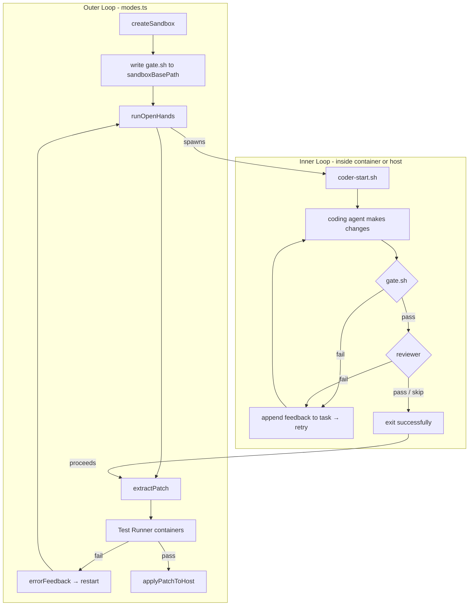

# Software Factory Inner Gate Loop

This document describes the **inner gate loop** — a rapid validation loop that runs _inside_ the Leash container (or on the host in `--dangerous-debug` mode) after each OpenHands run. Its purpose is to shorten the feedback cycle and reduce the cost of iterations by catching deterministic failures (e.g. lint, typecheck, public tests) before the expensive outer tests step.

## Overview

**Key principle:** The gate runs inside the agent's environment with direct access to `/workspace` (the agent's live files). No HTTP, no bind-mount races, no host-side trust surface. The outer loop (Test Runner, hidden tests) remains the authoritative enforcement layer. The gate is a cheap early-exit.

### Architecture



## Implementation

### 1. `coder-start.sh`

A shell script that wraps each agent invocation with a post-run validation step.

- **Location:** `src/orchestrator/scripts/coder-start.sh`
- **In container:** Copied into the Docker image at `/factory/coder-start.sh` (see `Dockerfile.coder`)
- **Not modifiable by the agent:** Baked into the image; the agent cannot reach it

**Behaviour:**

1. Read environment variables: `FACTORY_INITIAL_TASK`, `FACTORY_GATE_RETRIES`, `FACTORY_GATE_SCRIPT`, `FACTORY_AGENT_SCRIPT`
2. Run `FACTORY_STARTUP_SCRIPT` once.
3. Loop up to `FACTORY_GATE_RETRIES` times (default: 5):
   - Write `$current_task` to `$FACTORY_TASK_PATH` (default: `/workspace/.factory_task.md`)
   - Invoke the agent script: `bash "$FACTORY_AGENT_SCRIPT"` — the script must read the task from `$FACTORY_TASK_PATH`
   - If `FACTORY_GATE_SCRIPT` (or `/factory/gate.sh`) does not exist → treat as gate pass (gate_exit=0)
   - Else run the gate script, capture stdout+stderr and exit code
   - If gate exits 0: run the semantic reviewer (if `FACTORY_REVIEWER_SCRIPT` is set and exists). If reviewer passes → exit 0 (success). If reviewer fails → append output and loop again
   - If gate exits non-zero → append the output to `current_task` as "## Validation Failed — Fix Before Finishing" and loop again
4. If max rounds exhausted without gate/reviewer passing → exit 1

**Environment variables:**

| Variable                  | Required | Default                       | Description                                                            |
| ------------------------- | -------- | ----------------------------- | ---------------------------------------------------------------------- |
| `FACTORY_INITIAL_TASK`    | yes      | —                             | Full task prompt; written to `FACTORY_TASK_PATH` each round            |
| `FACTORY_GATE_RETRIES`    | no       | 5                             | Max inner loop rounds before giving up                                 |
| `FACTORY_GATE_SCRIPT`     | no       | `/factory/gate.sh`            | Path to the gate script                                                |
| `FACTORY_REVIEWER_SCRIPT` | no       | —                             | Path to the semantic reviewer script; when set, runs after gate passes |
| `FACTORY_AGENT_SCRIPT`    | no       | `/factory/agent.sh`           | Path to the agent runner script                                        |
| `FACTORY_TASK_PATH`       | no       | `/workspace/.factory_task.md` | Path where the current task is written before each invocation          |
| `FACTORY_STARTUP_SCRIPT`  | yes      | —                             | Path to a script run once before the agent loop                        |

### 2. `Dockerfile.coder`

The loop script is copied into the Leash coder image:

```dockerfile
RUN mkdir -p /factory
COPY src/orchestrator/scripts/coder-start.sh /factory/coder-start.sh
RUN chmod +x /factory/coder-start.sh
```

The container entrypoint is `/factory/coder-start.sh` (invoked by `leash`); it is not `openhands` directly.

### 3. `gate.sh` (per-profile default gate script)

The default gate script used when no custom `--gate-script` is provided. Each sandbox profile defines its own `gate.sh`.

- **Location:** `src/sandbox-profiles/<profile-id>/gate.sh` (e.g. `node-pnpm-python/gate.sh`, `go/gate.sh`, `rust/gate.sh`)
- **Loaded at runtime:** The CLI's `parseGateScript(ctx, profile)` calls `readSandboxGateScript(profile.id)` when `--gate-script` is not set.
- **Profiles:** Every profile must have a `gate.sh`. Node has a no-op placeholder (warns to use `--gate-script`); Go and Rust have language-specific defaults (e.g. `go vet`+`go test`, `cargo check`+`clippy`+`test`).

**Note:** In Leash (container) mode, `/workspace` is the mounted sandbox. In `--dangerous-debug` mode, `/workspace` does not exist on the host; users running without Leash should provide a custom gate that uses the current directory or `$FACTORY_WORKSPACE_BASE`.

### 4. Sandbox (`sandbox.ts`)

- **`Sandbox.gatePath`:** `sandboxBasePath/gate.sh` — path to the gate script on the host
- **`CreateSandboxOpts.gateScript`:** Content of the gate script. Supplied by the CLI; when `--gate-script` is not set, the CLI reads `gate.sh` from the resolved sandbox profile.
- **`createSandbox`:** Writes `gate.sh` to `sandboxBasePath/gate.sh` with mode `0o755` at the end of sandbox creation.

### 5. Agent runner (`agent-runner.ts`)

**`RunAgentOpts`:**

- `sandboxBasePath` — used to locate `gate.sh`, `startup.sh`, and `agent.sh` for mounting
- `agentPath` — absolute host path to `sandboxBasePath/agent.sh`; mounted `:ro` at `/factory/agent.sh`
- `gateRetries` — max gate retries (required; caller supplies default)
- `agentEnv` — extra env vars to forward into the container (reserved keys filtered out)
- `agentLogFormat` — `'openhands'` (parse JSON event stream) or `'raw'` (line-stream)

**Leash mode:**

- Mount `sandboxBasePath/gate.sh` at `/factory/gate.sh` with `:ro` (read-only)
- Mount `sandboxBasePath/agent.sh` at `/factory/agent.sh` with `:ro` (read-only)
- Pass `FACTORY_INITIAL_TASK`, `FACTORY_GATE_RETRIES`, `FACTORY_AGENT_SCRIPT`, `FACTORY_WORKSPACE_BASE` as environment variables
- Invoke `/factory/coder-start.sh` as the container command (not the agent directly)

**Dangerous-debug mode:**

- Run `bash src/orchestrator/scripts/coder-start.sh` from the repo root on the host
- Set `spawnCwd` to `codePath` (the sandbox code directory)
- Set `FACTORY_GATE_SCRIPT` to `sandboxBasePath/gate.sh` (host path)
- Set `FACTORY_AGENT_SCRIPT` to `sandboxBasePath/agent.sh` (host path)
- Same inner loop behaviour; the agent and the gate run on the host

### 6. Orchestrator (`modes.ts`)

**`OrchestratorOpts` (required, resolved by CLI):**

- `gateScript: string` — content of the gate script
- `agentScript: string` — content of the agent runner script
- `agentEnv: Record<string, string>` — extra env vars to forward to the agent
- `agentLogFormat: 'openhands' | 'raw'` — how to display agent stdout
- `gateRetries: number` — max gate retries (default: 10)

**`runStart`:** Passes `gateScript`, `agentScript`, and `gateRetries` to `createSandbox` and `runAgent`.

**`runResume`:** Reconstructs workspace from storage, then delegates to `runStartCore` (which uses `createSandbox` and `runAgent`). Scripts come from the stored config; CLI overrides are merged in.

### 7. CLI (`scripts/commands/agents.ts`)

**Flags for `saifac feat run` and `saifac run resume`:**

| Flag                      | Description                                                                            | Default              |
| ------------------------- | -------------------------------------------------------------------------------------- | -------------------- |
| `--gate-script`           | Path to a shell script to use as the gate                                              | Profile's `gate.sh`  |
| `--gate-retries`          | Max gate retries per run                                                               | 10                   |
| `--agent-script`          | Path to a bash script that runs the coding agent; reads task from `$FACTORY_TASK_PATH` | Built-in (OpenHands) |
| `--agent-env KEY=VALUE`   | Extra env var to forward into the agent container (repeatable)                         | —                    |
| `--agent-env-file <path>` | Path to a `.env` file with extra env vars to forward                                   | —                    |
| `--agent-log-format`      | How to parse agent stdout: `openhands` (JSON events) or `raw` (line stream)            | `openhands`          |

**Parsing:**

- `parseGateScript(ctx, profile)`: If `--gate-script` is not set or empty, returns `readSandboxGateScript(profile.id)` and `isDefault: true`. Otherwise reads the file and returns its content.
- `parseGateRetries(ctx)`: If `--gate-retries` is not set, returns 5. Otherwise parses a positive integer.
- `parseAgentScript(ctx)`: If `--agent-script` is not set, returns `DEFAULT_AGENT_SCRIPT` (OpenHands) and `isDefault: true`. Otherwise reads the file and returns its content.
- `parseAgentEnv(ctx)`: Merges `--agent-env-file` entries (first) and `--agent-env KEY=VALUE` flags (override). Malformed entries emit a warning and are skipped.
- `parseAgentLogFormat(ctx)`: Returns `'raw'` if `--agent-log-format raw`; defaults to `'openhands'`.

---

## Sandbox Directory Layout

After sandbox creation:

```
/tmp/factory-sandbox/{proj}-{feat}-{runId}/
  gate.sh              ← written by createSandbox; mounted :ro at /factory/gate.sh
  startup.sh           ← written by createSandbox; mounted :ro at /factory/startup.sh
  agent.sh             ← written by createSandbox; mounted :ro at /factory/agent.sh
  tests.full.json
  code/                ← rsync copy of repo; mounted as /workspace
    .git/
    saifac/...
    ...
```

---

## Security

- **`gate.sh`** and **`agent.sh`** are mounted `:ro` — tamper-proof at the kernel level; the agent cannot overwrite them even with root.
- **`coder-start.sh`** is baked into the image — not injected per-run, not modifiable by the agent.
- The gate runs inside the container with access to `/workspace` only — no host-side trust surface, no HTTP, no bind-mount race conditions.
- The **Test Runner** (hidden tests) remains the authoritative enforcement layer. The gate is purely a cheap early-exit that catches deterministic failures before the expensive Docker build and test runner run.
- The agent **can observe** gate output — it is fed back as task feedback. This is intentional: the feedback comes from the user's own public check, not from hidden tests.
- **`agentEnv`** reserved-key filtering: factory internal variables (`FACTORY_*`, `LLM_*`, `REVIEWER_LLM_*`) cannot be overridden by user-supplied `--agent-env` flags. The runner emits a warning and ignores them.

---

## Usage Examples

### Default gate (built-in)

```bash
saifac feat run
# Gate runs the default script (e.g. npm run check) inside the container after each OpenHands round
```

### Custom gate script

```bash
# my-gate.sh
#!/bin/bash
set -euo pipefail
cd /workspace
pnpm check && python -m pytest tests/unit/

saifac feat run --gate-script ./my-gate.sh
```

### Disable gate (pass-through)

```bash
# Create an empty script that exits 0
echo '#!/bin/bash
exit 0' > /tmp/noop-gate.sh
saifac feat run --gate-script /tmp/noop-gate.sh
```

### Tune gate retries

```bash
saifac feat run --gate-retries 3
```

### Custom agent script (Aider)

```bash
# aider-runner.sh
#!/bin/bash
set -euo pipefail
aider --message-file "$FACTORY_TASK_PATH" --yes

saifac feat run --agent-script ./aider-runner.sh --agent-log-format raw
```

### Custom agent script (Claude Code)

```bash
# claude-runner.sh
#!/bin/bash
set -euo pipefail
claude --print "$(cat "$FACTORY_TASK_PATH")"

saifac feat run --agent-script ./claude-runner.sh --agent-log-format raw
```

### Forwarding custom env vars

```bash
# Pass individual vars
saifac feat run --agent-env AIDER_MODEL=gpt-4o --agent-env AIDER_YES=1

# Or use an env file
# agent.env
# AIDER_MODEL=gpt-4o
# AIDER_YES=1
saifac feat run --agent-env-file ./agent.env
```

### Dangerous-debug mode (host execution)

```bash
saifac feat run --dangerous-debug
```

The inner loop runs on the host. The default gate assumes `/workspace`; for `--dangerous-debug`, use a custom gate that runs from the current directory (the spawn cwd is `codePath`).

---

## Best Practices

**Define a custom gate script.** Profile defaults (e.g. `go vet`+`go test`, `cargo check`+`clippy`+`test`, or the node-pnpm-python no-op) are fallbacks. You should supply `--gate-script` with a project-specific script that:

- Runs all checks your team expects before merge: lint, typecheck, format, unit tests.
- Is deterministic and fast — it runs after every agent round, so keep it cheap.
- Uses a single command (e.g. `npm run check` or `make check`) that bundles everything, so the agent sees one clear pass/fail signal.

Commit the gate script to your repo and reference it via `--gate-script ./scripts/gate.sh` so teammates get consistent behavior.

---

## Feedback Flow

When the gate or semantic reviewer fails:

1. `coder-start.sh` captures stdout+stderr from the gate or reviewer
2. It rebuilds the task prompt: original task + `## Validation Failed — Fix Before Finishing` + a code block containing the output
3. OpenHands is invoked again with this augmented prompt
4. The agent sees the failure and can fix the code
5. The loop repeats until the gate passes or max rounds are reached

Example feedback injected into the task:

```
## Validation Failed — Fix Before Finishing

```

> agents@0.0.0 check
> tsx src/commands/cli.ts check

sh: 1: tsx: not found

```

Fix the above issues.
```

---

## Design Decisions (from implementation history)

### Why the gate runs inside the container

An alternative design used a host-side HTTP gate server that the container would call. This was rejected because:

- **RCE risk:** The agent could exploit the HTTP endpoint to run arbitrary code on the host
- **Bind-mount races:** The host could modify mounted files while the container was still running
- **Complexity:** Managing host-side dependencies and connectivity added surface area

Running the gate _inside_ the container eliminates the host-side attack surface and keeps trust boundaries simple.

### Why `gateScript` and `gateRetries` are required in `OrchestratorOpts`

Defaults are applied by the CLI, not by the orchestrator. All `OrchestratorOpts` fields are non-optional where possible; the CLI resolves `--gate-script` and `--gate-retries` and passes concrete values. Modes that do not use the inner loop (e.g. `fail2pass`, `test`) still receive these fields but with placeholder values.

### Why the default gate lives in a separate file

The default gate script lives in `src/sandbox-profiles/<profile-id>/gate.sh`. Each profile (node-pnpm-python, go, rust, etc) defines its own gate; the CLI resolves the profile and reads the profile's `gate.sh` when `--gate-script` is not provided.
