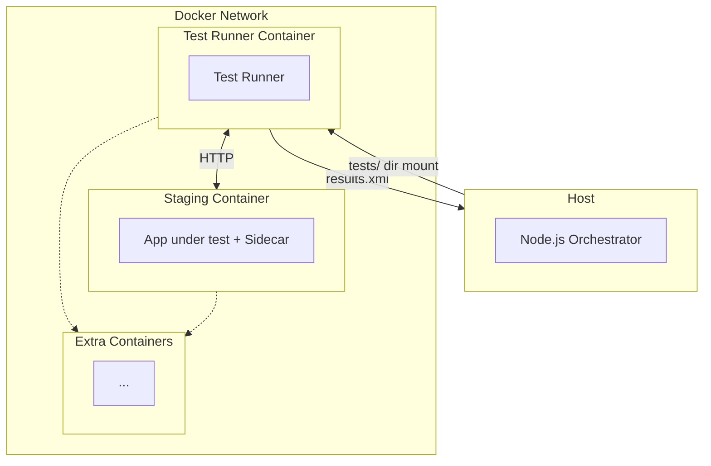

# Software Factory: Test Runner Container

The Test Runner is the container that runs tests in the Software Factory's Black Box verification architecture. It runs tests against the Staging container over HTTP, never touching the code or Docker socket directly. This document describes the contracts between the Orchestrator, Test Runner, and Staging containers, and how to use custom test languages or runners.

---

## Overview

| Role            | Container              | Communication                                                          |
| --------------- | ---------------------- | ---------------------------------------------------------------------- |
| **Host**        | Orchestrator (Node.js) | Creates containers, bind-mounts files, parses results                  |
| **Test Runner** | Test runner            | Reads env vars, runs tests, writes JUnit XML to `/test-runner-output/` |
| **Staging**     | Application under test | Exposes HTTP sidecar (CLI exec) and optionally a web app               |

The Test Runner is a black box to the Orchestrator: it only receives mounts + env vars and must produce a JUnit XML report. The **test runner script** (`test.sh`) is always bind-mounted at `/usr/local/bin/test.sh` — never baked into the image — so you can change the test language or runner without rebuilding the Test Runner image.



- **Host ↔ Test Runner:** Communication via `results.xml` — the Orchestrator bind-mounts `reportDir` to `/test-runner-output/`; the Test Runner writes the JUnit XML report there; the Host parses it after the container exits.
- **Test Runner ↔ Staging:** Communication over the shared Docker network (e.g. `http://staging:3000`, `http://staging:8080/exec`).
- **Extra containers:** Both Test Runner and Staging can reach additional services (databases, mocks, etc.) on the same network when needed.

---

## Contract: Host ↔ Test Runner

### Environment Variables (Required)

The Orchestrator passes these environment variables to the Test Runner container. Your `test.sh` (or custom entrypoint) must read them.

| Variable               | Description                                                                                                                                                          |
| ---------------------- | -------------------------------------------------------------------------------------------------------------------------------------------------------------------- |
| `SAIFAC_TARGET_URL`   | URL of the application under test. For CLI projects = sidecar URL; for web projects = app base URL (e.g. `http://staging:3000`).                                     |
| `SAIFAC_SIDECAR_URL`  | URL of the HTTP sidecar that executes CLI commands. Format: `http://staging:<port><path>` (e.g. `http://staging:8080/exec`). Always defined — even for web projects. |
| `SAIFAC_FEATURE_NAME` | SAIFAC feature name (e.g. `greet-cmd`).                                                                                                                              |
| `SAIFAC_TESTS_DIR`    | Absolute path inside the container where test files are mounted. Default: `/tests`.                                                                                  |
| `SAIFAC_OUTPUT_FILE`  | Absolute path where the container **must write the JUnit XML report**. Default: `/test-runner-output/results.xml`.                                                   |

### Volume Mounts

| Host path                   | Container path           | Mode  |
| --------------------------- | ------------------------ | ----- |
| `{testsDir}/public/`        | `/tests/public/`         | `:ro` |
| `{testsDir}/hidden/`        | `/tests/hidden/`         | `:ro` |
| `{testsDir}/helpers.ts`     | `/tests/helpers.ts`      | `:ro` |
| `{testsDir}/infra.spec.ts`  | `/tests/infra.spec.ts`   | `:ro` |
| `{sandboxBasePath}/test.sh` | `/usr/local/bin/test.sh` | `:ro` |
| `{reportDir}/`              | `/test-runner-output/`   | `:rw` |

Each of `public/`, `hidden/`, `helpers.ts`, and `infra.spec.ts` is mounted only if it exists on the host. The `test.sh` and `reportDir` mounts are always present.

- `testsDir` = `{projectDir}/{saifDir}/features/{featureName}/tests`
- `reportDir` = sandbox root (e.g. `/tmp/saifac/proj-feat-abc123`)
- `test.sh` is written by the Orchestrator from `test-default.sh` (or a custom `--test-script`).

### Exit Code Contract

| Exit code | Meaning                                    |
| --------- | ------------------------------------------ |
| `0`       | All tests passed.                          |
| non-zero  | One or more tests failed, or runner error. |

### Output File Contract

- **Format:** JUnit XML.
- **Path:** Written to `$SAIFAC_OUTPUT_FILE` (default `/test-runner-output/results.xml`).
- **Bind-mount:** `reportDir` on the host maps to `/test-runner-output` in the container, so the Orchestrator reads `{reportDir}/results.xml` after the container exits.
- **Absent file:** If the runner crashes before producing output, the file may be absent; the Orchestrator handles this gracefully (falls back to exit code only).

JUnit XML is the universal format: Vitest, pytest, go test, cargo test, and most CI systems support it. The Orchestrator parses it for per-suite analysis (e.g. `hasFeatureSuccessfullyFailed` to distinguish infra vs feature test failures in fail2pass).

---

## Contract: Test Runner ↔ Staging

The Test Runner communicates with the Staging container **only over HTTP** on a shared Docker bridge network. No shared memory, no Docker socket.

### Network

- All containers join `saifac-net-{runId}`.
- Staging container has network alias `staging`.
- Test Runner reaches it via `http://staging:<port><path>`.

### Sidecar (CLI Projects)

For CLI/non-web projects, the sidecar wraps command execution:

**Request:** `POST` to `SAIFAC_SIDECAR_URL` (e.g. `http://staging:8080/exec`):

```json
{
  "cmd": "pnpm run greet",
  "args": ["Alice"],
  "env": { "GREETING": "Hi" }
}
```

**Response:** `200 OK` JSON:

```json
{
  "stdout": "Hello, Alice! Welcome to the agents framework.\n",
  "stderr": "",
  "exitCode": 0
}
```

Tests use `helpers.ts` → `execSidecar({ cmd, args, env })`, which reads `SAIFAC_SIDECAR_URL` from the environment (injected by the Orchestrator).

### Web App (Web Projects)

For web projects, `tests.json` sets `containers.staging.baseUrl` (e.g. `http://staging:3000`). `SAIFAC_TARGET_URL` is set to that value. Tests use `helpers.ts` → `baseUrl()` and `httpRequest()` to hit endpoints directly.

---

## Directory Layout: `tests/`

```
tests/
├── tests.json      # Test catalog (visibility, entrypoints, containers config)
├── tests.md        # Human-readable test plan (design phase)
├── helpers.ts      # execSidecar, baseUrl, httpRequest (read SAIFAC_* env vars)
├── infra.spec.ts   # Sidecar health checks (CLI only)
├── public/         # Public specs (visible to coder)
│   └── *.spec.ts
└── hidden/         # Hidden specs (holdout for mutual verification)
    └── *.spec.ts
```

The Orchestrator mounts these into the Test Runner. The default `test-default.sh` runs Vitest with `--root "${SAIFAC_TESTS_DIR}"` and `--outputFile="${SAIFAC_OUTPUT_FILE}"`.

---

## Overrides: Custom Test Language or Runner

You can run tests in any language as long as your Test Runner image and `test.sh` obey the contract above.

### Pre-Built Images (Recommended)

Pre-built test runner images are published to `ghcr.io/JuroOravec/safe-ai-factory`. Supported profiles:

| Profile           | Image                                                                      |
| ----------------- | -------------------------------------------------------------------------- |
| node-vitest       | `ghcr.io/JuroOravec/safe-ai-factory/saifac-test-node-vitest:latest`       |
| node-playwright   | `ghcr.io/JuroOravec/safe-ai-factory/saifac-test-node-playwright:latest`   |
| python-pytest     | `ghcr.io/JuroOravec/safe-ai-factory/saifac-test-python-pytest:latest`     |
| python-playwright | `ghcr.io/JuroOravec/safe-ai-factory/saifac-test-python-playwright:latest` |
| go-gotest         | `ghcr.io/JuroOravec/safe-ai-factory/saifac-test-go-gotest:latest`         |
| go-playwright     | `ghcr.io/JuroOravec/safe-ai-factory/saifac-test-go-playwright:latest`     |
| rust-rusttest     | `ghcr.io/JuroOravec/safe-ai-factory/saifac-test-rust-rusttest:latest`     |
| rust-playwright   | `ghcr.io/JuroOravec/safe-ai-factory/saifac-test-rust-playwright:latest`   |

When `--test-image` is omitted, the orchestrator uses the default profile (`node-vitest`). Docker pulls the image from GHCR automatically when not present locally. To use another profile:

```bash
saifac feat run --test-profile python-pytest   # Uses GHCR python-pytest image
saifac feat run --test-image ghcr.io/JuroOravec/safe-ai-factory/saifac-test-node-playwright:latest
```

Use `:v1.0.0` (or another tag) to pin a release. See [docs/development/docker.md](../../../docs/development/docker.md).

### Option 1: Custom Test Script Only (Same Image)

Use the default profile image but run a different command:

```bash
saifac feat run --test-script ./my-test.sh
```

`my-test.sh` must:

1. Read `SAIFAC_TARGET_URL`, `SAIFAC_SIDECAR_URL`, `SAIFAC_TESTS_DIR`, `SAIFAC_OUTPUT_FILE`.
2. Run your test command.
3. Write JUnit XML to `$SAIFAC_OUTPUT_FILE`.
4. Exit 0 on pass, non-zero on fail.

Example — run a subset of specs:

```sh
#!/bin/sh
set -e
cd "${SAIFAC_TESTS_DIR}"
exec npx vitest run --reporter=junit --outputFile="${SAIFAC_OUTPUT_FILE}" public/
```

### Option 2: Custom Test Runner Image + Default test.sh

For **supported** runtimes (Python, Go, Rust, etc.) use the pre-built images above. Extend only when you need a runtime we don't provide.

**Example: Custom Python/pytest (unsupported variant)**

`Dockerfile.test.python`:

```dockerfile
FROM python:3.12-slim

RUN pip install --no-cache-dir pytest pytest-xdist
# Or: pip install pytest pytest-junitxml

WORKDIR /workspace

# Same CMD — test.sh is bind-mounted by Orchestrator
CMD ["/bin/sh", "/usr/local/bin/test.sh"]
```

Custom `test-pytest.sh` (pass via `--test-script`):

```sh
#!/bin/sh
set -e
cd "${SAIFAC_TESTS_DIR}"
# Run all Python specs; infra would be infra_spec.py if you have one
exec pytest -v --junitxml="${SAIFAC_OUTPUT_FILE}" public/ hidden/
```

Your Python tests must:

- Import `SAIFAC_SIDECAR_URL` / `SAIFAC_TARGET_URL` from `os.environ` and use them to call the sidecar or web app.
- Emit JUnit XML (e.g. `pytest --junitxml=...`).

Build and run (only needed for custom setups; for standard pytest use `--test-profile python-pytest` with the GHCR image):

```bash
docker build -f Dockerfile.test.python -t my-test-python .
saifac feat run --test-image my-test-python --test-script ./test-pytest.sh
```

### Option 3: Fully Custom Test Runner Image (Ignore test.sh Mount)

Your image can have its own `CMD` and ignore the bind-mounted `test.sh`. You must still:

1. Read `SAIFAC_TARGET_URL`, `SAIFAC_SIDECAR_URL`, `SAIFAC_TESTS_DIR`, `SAIFAC_OUTPUT_FILE`.
2. Run tests in `/tests/public/`, `/tests/hidden/`, etc.
3. Write JUnit XML to `$SAIFAC_OUTPUT_FILE`.
4. Exit 0 on pass, non-zero on fail.

**Example: Go Tests**

`Dockerfile.test.go`:

```dockerfile
FROM golang:1.22-alpine

WORKDIR /workspace

# Your image runs its own entrypoint
COPY run-tests.sh /usr/local/bin/
CMD ["/usr/local/bin/run-tests.sh"]
```

`run-tests.sh` (baked into image):

```sh
#!/bin/sh
set -e
cd "${SAIFAC_TESTS_DIR}"
go test -v -json 2>&1 | go-junit-report > "${SAIFAC_OUTPUT_FILE}"
# Or use gotestsum: gotestsum --junitfile "${SAIFAC_OUTPUT_FILE}" ./...
```

Your Go tests use `os.Getenv("SAIFAC_SIDECAR_URL")` to call the sidecar. Build and run (for standard Go use `--test-profile go-gotest` with the GHCR image):

```bash
docker build -f Dockerfile.test.go -t my-test-go .
saifac feat run --test-image my-test-go
```

### Option 4: Playwright / Browser Tests

For standard Playwright, use `--test-profile node-playwright` (or `python-playwright`, `go-playwright`, `rust-playwright`) with the GHCR images. To add Playwright to a custom image:

`Dockerfile.test.playwright`:

```dockerfile
FROM node:25-alpine

RUN npm install -g vitest tsx playwright @playwright/test --no-progress
RUN npx playwright install chromium --with-deps

WORKDIR /workspace

CMD ["/bin/sh", "/usr/local/bin/test.sh"]
```

Use `--test-script` with a script that runs Playwright/Vitest browser tests. Your tests hit `SAIFAC_TARGET_URL` (e.g. `http://staging:3000`) for the web app.

---

## CLI Reference

| Command                                                   | Purpose                                                                                |
| --------------------------------------------------------- | -------------------------------------------------------------------------------------- |
| `saifac feat run --test-profile <id>`                     | Use a specific profile. Default: `node-vitest`. Image pulled from GHCR when not local. |
| `saifac feat run --test-image <tag>`                      | Use a custom Test Runner image (GHCR or local). Must exist or be pullable.             |
| `saifac feat run --test-script <path>`                    | Override the default `test-default.sh` with a custom script.                           |
| `saifac feat run --test-image <tag> --test-script <path>` | Combine both. Script is bind-mounted; image provides runtime.                          |
| `pnpm docker build test [--all]`                          | Build test images locally (for development or offline; default images are on GHCR).    |

`--test-image` and `--test-script` apply to `saifac feat run`, `saifac run resume`, `feat:test`, and `saifac feat design-fail2pass`.

---

## Image Resolution (Default vs Custom)

| Scenario                       | Behavior                                                                               |
| ------------------------------ | -------------------------------------------------------------------------------------- |
| `--test-image` not provided    | Use `saifac-test-<profile>:latest`. Docker pulls from GHCR when not present locally.  |
| `--test-image my-tag` provided | Use `my-tag`. Must exist locally or be pullable; Docker pulls automatically if needed. |

For supported profiles, prefer GHCR images. Custom images must exist locally or be pullable.

---

## Helpers Contract for Tests

Tests (in any language) that run inside the Test Runner receive `SAIFAC_SIDECAR_URL` and `SAIFAC_TARGET_URL` from the environment. The default `helpers.ts` (TypeScript) uses them:

- `execSidecar({ cmd, args, env })` → `POST` to `SAIFAC_SIDECAR_URL` with `{ cmd, args, env }`.
- `baseUrl()` → returns `SAIFAC_TARGET_URL`.
- `httpRequest({ method, path, body })` → `fetch(baseUrl() + path, ...)`.

For non-JS tests (Python, Go, etc.), implement equivalent helpers that read `os.environ["SAIFAC_SIDECAR_URL"]` and `os.environ["SAIFAC_TARGET_URL"]`. The sidecar request/response format is fixed (see [swf-comp-b-black-box-testing.md](./swf-comp-b-black-box-testing.md)).

---

## JUnit XML Requirements

The Orchestrator parses JUnit XML for:

- Per-suite analysis (`hasFeatureSuccessfullyFailed` — skips `sidecar:health` infra tests in fail2pass).
- Vague Specs Checker input (failing test names and messages for ambiguity detection).

Your runner's JUnit output should follow the standard structure:

- Root: `<testsuites>` or `<testsuite>`.
- Each `<testcase>` has `name`, optional `classname`; failures in `<failure>` or `<error>`.
- Skipped tests use `<skipped/>`.

The parser tolerates minor variations across runners (Vitest, pytest, go-junit-report, etc.).

---

## See Also

- [swf-docker.md](./swf-docker.md) — Overall Docker architecture, staging container, build modes.
- [swf-comp-b-black-box-testing.md](./swf-comp-b-black-box-testing.md) — Test design, sidecar protocol, helpers.
- [swf-spec-ambiguity.md](./swf-spec-ambiguity.md) — Vague Specs Checker use of JUnit report for failure analysis.
